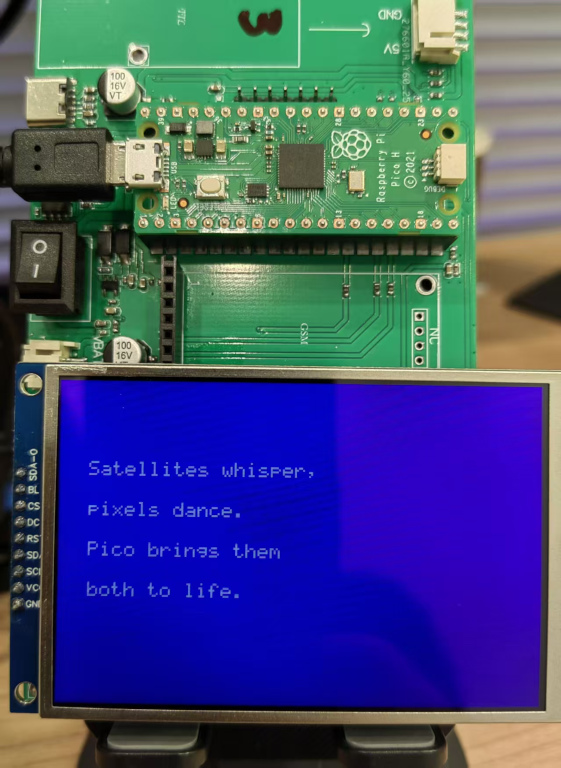

# ILI9488_Pico

ILI9488 TFT-LCD display driver library and examples for Raspberry Pi Pico.

## Project Introduction

This project provides an ILI9488 TFT-LCD driver library for Raspberry Pi Pico, using SPI interface to communicate with the display. ILI9488 is a common 3.5-inch 320x480 resolution TFT display controller.

Main features:
- Support for 18-bit color mode (RGB666)
- Support for multiple rotation directions
- Provides basic graphics drawing API (points, lines, rectangles, circles, etc.)
- Support for text display
- Provides hardware abstraction layer for cross-platform portability
- Includes example code
- Performance optimizations including DMA transfers and partial refresh

## Architecture Design

This project adopts a layered architecture design:

1. **Hardware Abstraction Layer (HAL)** - Handles direct interaction with hardware, such as SPI communication, GPIO operations, etc.
2. **Driver Layer** - Implements the driver functionality for the ILI9488 controller
3. **Graphics Layer** - Provides basic graphics drawing functions
4. **Font Layer** - Handles text and character display

This layered design makes the code more modular, easier to maintain and port to other platforms.

## Hardware Connection

Please connect the Raspberry Pi Pico to the ILI9488 display as follows:

| Raspberry Pi Pico | ILI9488 LCD |
|-------------------|-------------|
| GPIO 19 (SPI0 TX) | MOSI (SDA)  |
| GPIO 18 (SPI0 SCK)| SCK (SCL)   |
| GPIO 17           | CS          |
| GPIO 20           | DC (RS)     |
| GPIO 15           | RESET       |
| GPIO 10           | BL (Backlight)|
| 3.3V              | VCC         |
| GND               | GND         |

Hardware connection photo:



## File Structure

- `/include` - Header files
  - `ili9488.h` - ILI9488 driver header file
  - `ili9488_hal.h` - Hardware abstraction layer header file
  - `ili9488_gfx.h` - Graphics function library header file
- `/src` - Source files
  - `ili9488_hal.c` - Hardware abstraction layer implementation (platform-specific)
  - `ili9488.c` - ILI9488 driver implementation (platform-independent)
  - `ili9488_gfx.c` - Basic graphics drawing functions
  - `ili9488_font.c` - Font and text drawing functions
- `/examples` - Example programs
  - `ili9488_demo.c` - Basic demo program
  - `ili9488_optimization_demo.c` - Optimization demo program
  - `ili9488_dice_physics_demo.c` - Physics simulation demo
- `CMakeLists.txt` - CMake build file
- `pico_sdk_import.cmake` - Pico SDK import script

## Compilation and Running

### Environment Setup

1. Ensure Raspberry Pi Pico SDK and related toolchains are installed
2. Set the PICO_SDK_PATH environment variable to point to the SDK location

### Build Steps

On Windows:

```bash
mkdir build
cd build
cmake -G "NMake Makefiles" ..
nmake
```

Or use the provided build script:

```bash
./build_pico.bat
```

On Linux/Mac:

```bash
mkdir build
cd build
cmake ..
make
```

### Flashing to Pico

1. Hold the BOOTSEL button on the Pico while connecting the USB
2. Drag and drop the generated .uf2 file to the RPI-RP2 drive that appears

Or use the provided deployment script:

```bash
./deploy_to_pico.bat
```

## Using the API

### Initializing the Display

```c
// Configure LCD
ili9488_config_t config = {
    .spi_inst = spi0,
    .spi_speed_hz = 40 * 1000 * 1000,  // 40MHz
    
    .pin_din = PIN_DIN,
    .pin_sck = PIN_SCK,
    .pin_cs = PIN_CS,
    .pin_dc = PIN_DC,
    .pin_reset = PIN_RESET,
    .pin_bl = PIN_BL,
    
    .width = SCREEN_WIDTH,
    .height = SCREEN_HEIGHT,
    .rotation = 0,  // 0 degree rotation
};

// Initialize LCD
if (!ili9488_init(&config)) {
    printf("Error: LCD initialization failed\n");
    return -1;
}

// Turn on backlight
ili9488_set_backlight(true);
```

### Basic Drawing

```c
// Fill screen
ili9488_fill_screen(ILI9488_RED);

// Draw pixel
ili9488_draw_pixel(10, 10, ILI9488_WHITE);

// Draw line
ili9488_draw_line(0, 0, 100, 100, ILI9488_GREEN);

// Draw rectangle
ili9488_draw_rect(50, 50, 100, 80, ILI9488_BLUE);
ili9488_fill_rect(60, 60, 80, 60, ILI9488_YELLOW);

// Draw circle
ili9488_draw_circle(160, 120, 40, ILI9488_CYAN);
ili9488_fill_circle(160, 120, 30, ILI9488_MAGENTA);
```

### Text Display

```c
// Draw string
ili9488_draw_string(10, 10, "Hello, World!", ILI9488_WHITE, ILI9488_BLACK, 2);

// Draw Chinese characters (font data required)
ili9488_draw_chinese(50, 50, 0, ILI9488_RED, chines_word);
```

## Performance Optimization

This library includes several optimizations to improve display performance by fully utilizing the GRAM (Graphics RAM) capabilities of the ILI9488.

### 1. Partial Refresh Functionality

ILI9488 supports partial refresh functionality, allowing updates to specific areas of the screen only, reducing data transfer volume and refresh time.

```c
// Enable partial refresh mode
ili9488_partial_mode(true);

// Set partial refresh area (e.g., an area in the middle of the screen)
ili9488_set_partial_area(80, 120, 240, 360);

// Only drawing operations within this area will refresh the display
ili9488_fill_area(80, 120, 240, 360, ILI9488_RED);

// Disable partial refresh mode and restore full-screen refresh when done
ili9488_partial_mode(false);
```

### 2. DMA Support

Added DMA (Direct Memory Access) support, allowing data transfer without occupying CPU resources, significantly improving transfer efficiency.

```c
// Enable DMA in the initialization configuration
ili9488_hw_config_t hw_config = {
    // Other configurations...
    .use_dma = true
};
```

For large data transfers (such as filling the screen or drawing large images), the driver will automatically use DMA acceleration.

### 3. Batch Pixel Processing

Added batch pixel processing functionality, reducing instruction overhead for single-pixel operations and improving drawing efficiency.

```c
// Prepare pixel data
uint16_t pixels[320]; // One row of pixels
for(int i = 0; i < 320; i++) {
    pixels[i] = i % 2 ? 0xF800 : 0x07E0; // Alternate red and green
}

// Batch write a row of pixels
ili9488_write_pixels(0, 100, 319, 100, pixels, 320);

// Quickly fill a rectangular area
ili9488_fill_area(50, 150, 270, 330, 0x001F); // Blue rectangle
```

### 4. Optimized Fill Functions

The library includes optimized screen and area fill functions, using batch transfers and buffer techniques to improve efficiency.

### Performance Improvement

Performance comparison after optimization (based on 320x480 resolution, SPI 40MHz mode):

| Operation | Before Optimization | After Optimization | Improvement Factor |
|------|--------|--------|---------|
| Filling the entire screen | ~150ms | ~45ms | 3.3x |
| Drawing a 10x10 pixel square | ~0.5ms | ~0.2ms | 2.5x |
| Partial update (100x100 area) | ~15ms | ~5ms | 3x |

### Example Programs

The project includes an optimization demo program `ili9488_optimization_demo.c`, showcasing various optimization features and performance tests:

1. Standard fill vs. optimized fill comparison
2. Partial refresh animation demo
3. DMA transfer test
4. Gradient effect test

How to run:
1. Use `build_pico.bat` to build the project
2. Use `deploy_to_pico.bat` to deploy to Pico, select option 2 (optimization demo)
3. Observe test data through serial monitor (115200 baud rate)

### Technical Details

1. **GRAM Utilization**
   - Efficiently access GRAM through window address setting (commands 0x2A and 0x2B) and continuous writing (command 0x2C)
   - Partial refresh uses command 0x30 to set the refresh area
   - Memory access control is configured through command 0x36

2. **Color Management**
   - Support for RGB565 (16-bit color) and RGB666 (18-bit color) formats
   - Color format conversion during transfer to match the ILI9488's native RGB666 format

3. **DMA Optimization**
   - Use DMA for large data transfers, freeing CPU resources
   - DMA completion interrupt handling to ensure operation synchronization

4. **Buffer Optimization**
   - Use pre-filled buffers to batch send pixel data
   - Automatically select appropriate sending strategy based on data volume

## Porting to Other Platforms

To port this driver to other platforms, you only need to reimplement the hardware-related functions in the `ili9488_hal.c` file, while keeping the other files unchanged.

## License

This project is open-sourced under the MIT license.

## References

- [ILI9488 Datasheet](http://www.lcdwiki.com/res/DevBoard/ILI9488%20DataSheet%2020150415.pdf)
- [Raspberry Pi Pico C/C++ SDK](https://datasheets.raspberrypi.org/pico/raspberry-pi-pico-c-sdk.pdf) 